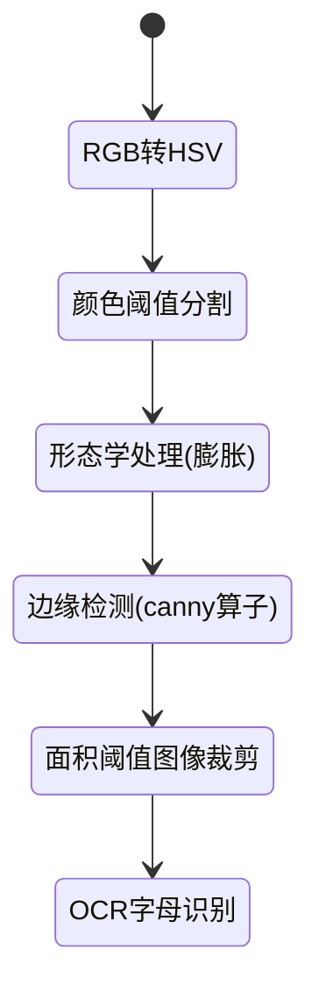

## 硬件
硬件采用DJTT无人机

DJTT无人机由无人机控制器和拓展模块组成，其中无人机控制器内置电路已经完成了所有关于无人机操作的集成，只需要通过给无人机发送指令即可让其运动。

无人机硬件相关信息可参考DJ官网：[大疆无人机官网](https://robomaster-dev.readthedocs.io/zh-cn/latest/python_sdk/installs.html)
其官方例程可以通过网站查找：[官方例程](https://gitee.com/xitinglin/RoboMaster-SDK/tree/master/examples/12_drone)
## 软件
### 使用到的库
- 图像处理：opencv
**安装过程:** `pip install opencv-python`
- 图像识别：tesseractOCR 
**安装过程:**  [下载地址](https://digi.bib.uni-mannheim.de/tesseract/),随便下载一个版本，然后在环境变量中添加tesseract.exe的路径，在cmd中输入`tesseract -v`进行验证。python环境中输入`pip install pytesseract`安装。
- 无人机控制：DJsdk
**安装过程:** 下载地址[SDK下载教程](https://robomaster-dev.readthedocs.io/zh-cn/latest/python_sdk/installs.html)
### 图像识别流程

